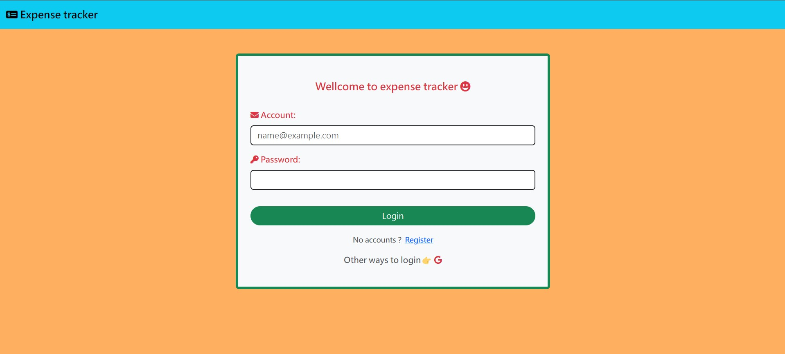
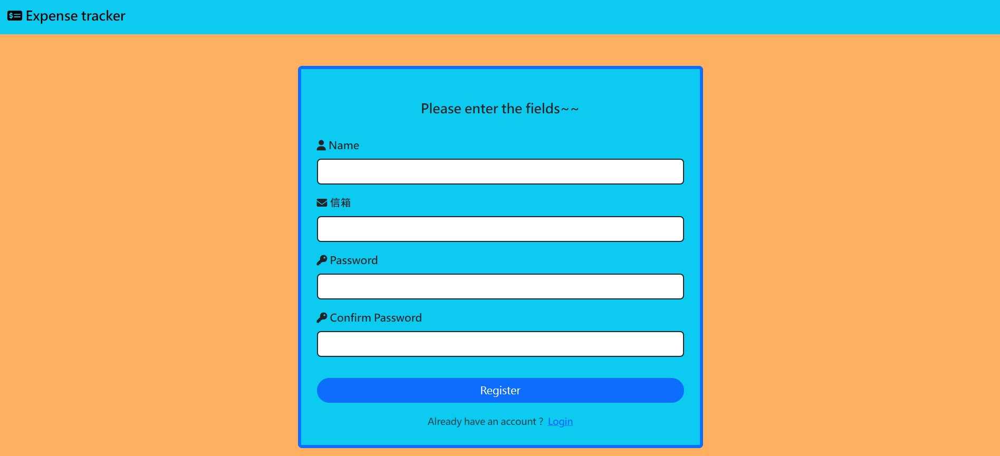

# Expense Tracker

This project is designed for recording personal expenses. Users can search, add, edit, and delete expenses, categorize expenses, and check the total expenses.

## Features

1. Users can register an account<br>
  (1). After registration, users can log in/out<br>
  (2). Only logged-in users can use the project services.
   
2. Log in with a `Google` account, and upon successful verification, users are directed to their personal expense list page.
   
3. View the list of expenses created by the user and the total amount.
   
4. Able to categorize expenses by year, month, and category
, and display the total expense amount.   

5. Able to view a pie chart showing the proportion of each category in the total expenses.
   
6. `Add`, `Edit`, and `Delete` an expense.

## System Architecture


## Development Environment

- [Windows](https://www.microsoft.com/zh-tw/windows/windows-11)
- [Node.js v18.15.0](https://nodejs.org/en)

## Prerequisites

* [Docker](https://www.docker.com/)
* [MySQL Server](https://dev.mysql.com/downloads/mysql/)
* [Git](https://git-scm.com/)

## Start the Project Locally

1. Open a terminal and run `git clone` to download the project to your computer

```bash
$ git clone https://github.com/yuan6636/expense-tracker.git
```

1. Navigate to the `expense-tracker` folder

```bash
$ cd expense-tracker
```

1. Install packages with `npm`

```bash
$ npm install
```

1. Ensure `config.js` has the correct `password` and `database` settings

```js
"development": {
    "username": "root",
    "password": "password",
    "database": "record",
    "host": "127.0.0.1",
    "dialect": "mysql"
  }
```

5. Set up the database
   
```bash
$ npm run dbsetup
$ npm run seed
```

6. Obtain `GOOGLE_CLIENT_ID` and `GOOGLE_CLIENT_SECRET` from the `Google API Console`

7.  Create a `.env` file, and populate it with tne contents from `.env.example`. Set `SESSION_SECRET` to a value of your choice, and `MYSQL_ROOT_PASSWORD` to the password you set for `MySQL`.

```
SESSION_SECRET= <Your session secret>
GOOGLE_CLIENT_ID= <Your google client ID> 
GOOGLE_CLIENT_SECRET= <Your google client secret>
MYSQL_ROOT_PASSWORD= <Your mysql server password>
```

8. Run `app.js`

```bash
$ npm run dev
```

9. If the terminal displays the following message, it means `server` has started successfully

```bash
App is running on localhost:3000
```

10. Open your browser and go to `http://localhost:3000` to use the project

11. To stop the `server`, press `ctrl + C` in the terminal

## Testing
- Run the following command to perform tests
```bash
npm run test
```

## Demo


## Screenshots





### Contributors

Developer: [yuan6636](https://github.com/yuan6636)